# Campus QuickSplit

**Split shared expenses offline, settle up with confidence, sync privately when you want to.**

Campus QuickSplit is a **local-first** Flutter expense-splitting app: every group, expense, balance, and settlement lives in an on-device SQLite database and works with zero network connection. An optional Firebase layer lets a signed-in user privately back their own data up to the cloud and restore it on another device.


---

## Table of Contents

- [Demo Video](#demo-video)
- [Screenshots](#screenshots)
- [Overview](#overview)
- [Why Campus QuickSplit?](#why-campus-quicksplit)
- [Problem Statement](#problem-statement)
- [Key Features](#key-features)
- [System Architecture](#system-architecture)
- [Application Architecture](#application-architecture)
- [Local-First Data Flow](#local-first-data-flow)
- [Expense Creation Flow](#expense-creation-flow)
- [Settlement Flow](#settlement-flow)
- [Firebase Sync Architecture](#firebase-sync-architecture)
- [QR Group Invitations](#qr-group-invitations)
- [Data Model](#data-model)
- [Expense Splitting](#expense-splitting)
- [Money & Financial Correctness](#money--financial-correctness)
- [Balance & Settlement Algorithm](#balance--settlement-algorithm)
- [Technology Stack](#technology-stack)
- [Project Structure](#project-structure)
- [Quick Start](#quick-start)
- [Requirements](#requirements)
- [Installation](#installation)
- [Running the App](#running-the-app)
- [Firebase Setup](#firebase-setup)
- [Configuration](#configuration)
- [Build](#build)
- [Testing](#testing)
- [Backup & Restore](#backup--restore)
- [Security & Privacy](#security--privacy)
- [Limitations](#limitations)
- [Roadmap / Future Improvements](#roadmap--future-improvements)
- [Contributing](#contributing)
- [License](#license)

---

## Demo Video

[Watch the Campus QuickSplit Demo](https://drive.google.com/file/d/1kwCOjCEbftChpT7BemInh0HbDXJwcsgm/view?usp=drivesdk)

# Youtube Link if drive not available [Watch the Campus QuickSplit Demo](https://youtube.com/shorts/KtrlTQe5fEg?si=Rb6RnFos0A_GFDti)


## 📱 Download APK

Try Campus QuickSplit on Android:

[⬇️ Download Campus QuickSplit APK](https://github.com/KaranAgrawal25/Campus-QuickSplit/releases/latest)

### Screenshots

<p align="center">
  <i>Explore the Campus QuickSplit experience</i>
</p>

<table>
  <tr>
    <th align="center">Onboarding</th>
    <th align="center">Dashboard</th>
  </tr>
  <tr>
    <td align="center">
      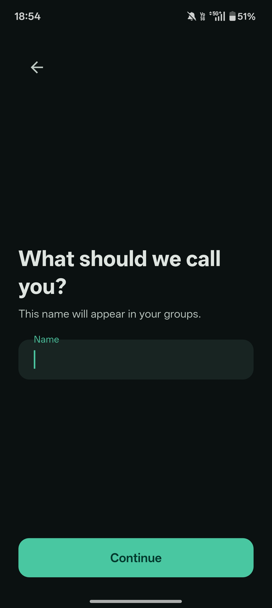
    </td>
    <td align="center">
      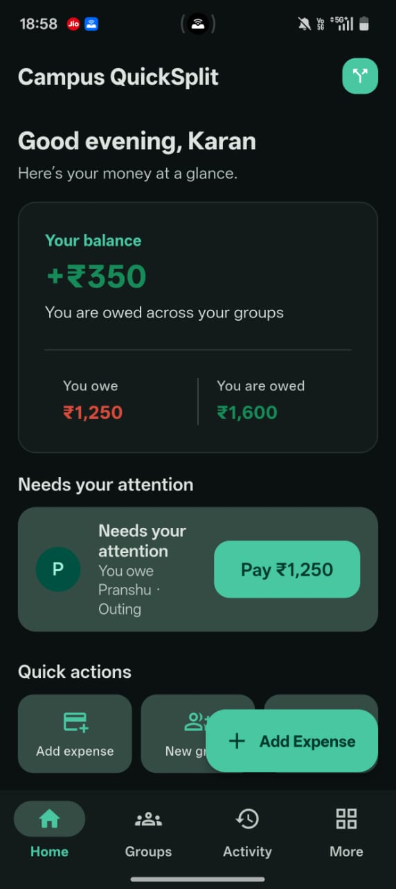
    </td>
  </tr>

  <tr>
    <th align="center">Dashboard Overview</th>
    <th align="center">Groups</th>
  </tr>
  <tr>
    <td align="center">
      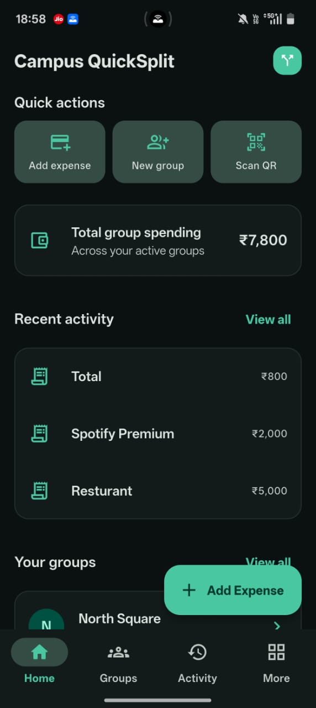
    </td>
    <td align="center">
      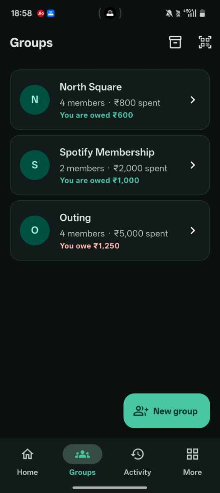
    </td>
  </tr>

  <tr>
    <th align="center">Group Detail</th>
    <th align="center">Add Expense</th>
  </tr>
  <tr>
    <td align="center">
      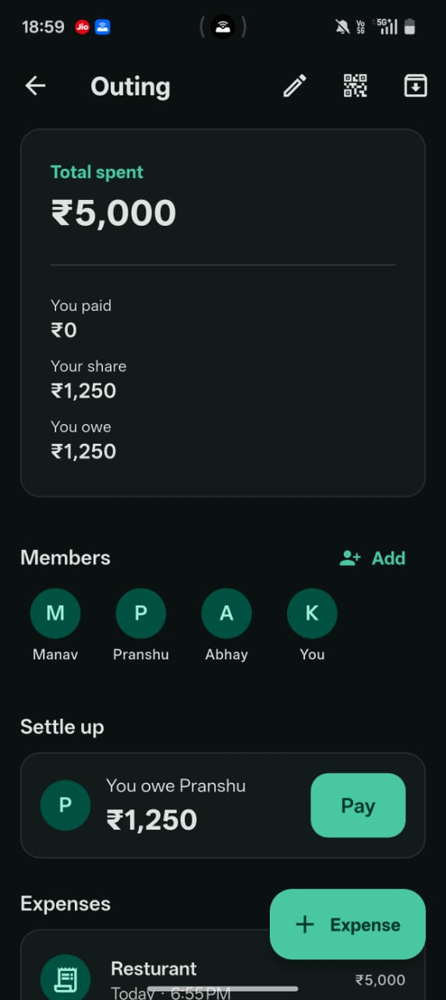
    </td>
    <td align="center">
      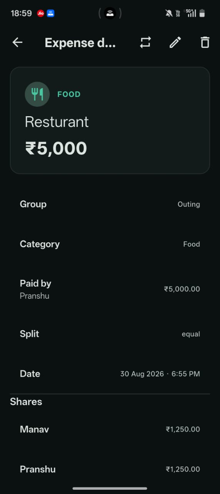
    </td>
  </tr>

  <tr>
    <th align="center">Activity</th>
    <th align="center">Analytics</th>
  </tr>
  <tr>
    <td align="center">
      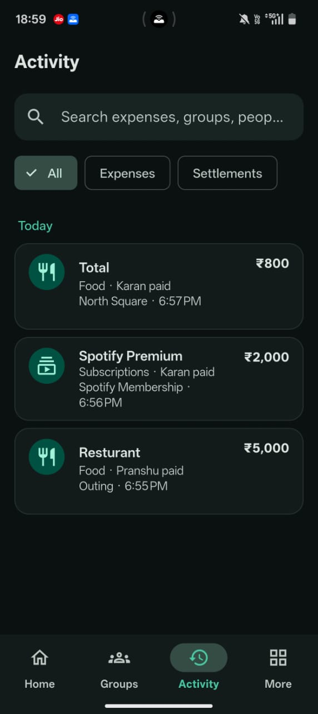
    </td>
    <td align="center">
      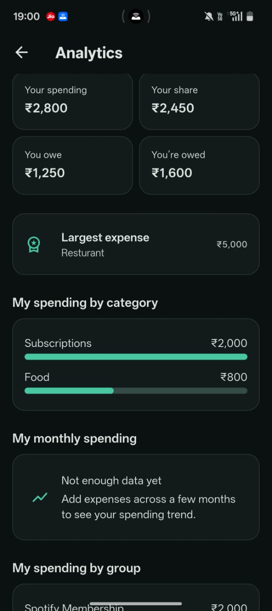
    </td>
  </tr>

  <tr>
    <th align="center">More — Main</th>
    <th align="center">More — Backup & Settings</th>
  </tr>
  <tr>
    <td align="center">
      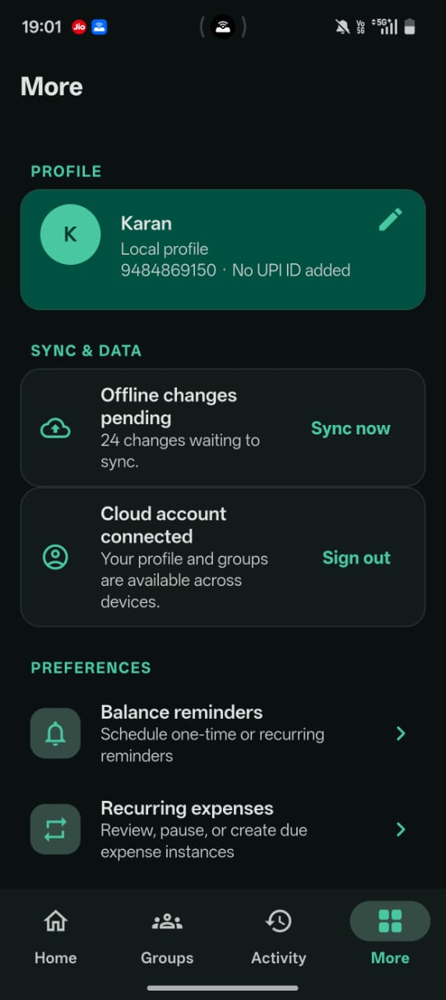
    </td>
    <td align="center">
      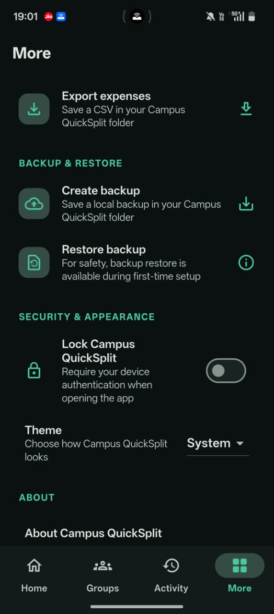
    </td>
  </tr>
</table>

---

## Overview

Campus QuickSplit tracks shared expenses for groups where costs get split unevenly and are often paid by more than one person at a time — a hostel room, a flat-share, a trip, a project team. It's built for anyone tired of reconstructing "who owes whom" from a group chat and a mental spreadsheet.

The app is **local-first by design**: an on-device Drift/SQLite database is the single source of truth, and every core workflow — creating groups, logging expenses with any split type, computing balances, viewing history, exporting data, scheduling reminders — works completely offline. Cloud sync through Firebase is a genuinely optional layer on top: sign in, and your own data is privately backed up and can be restored to another device signed into the same account. Firebase initialization is defensive, so a missing or misconfigured Firebase project simply leaves the app running local-only rather than failing to start.

Every rupee amount in the app is represented and calculated as an **integer number of paise**, never a floating-point value — the split, balance, and settlement engines are built specifically to avoid the rounding drift that floating-point currency math is prone to.

## Why Campus QuickSplit?

- **Offline-first, not offline-tolerant** — the database *is* the app; there's no degraded "offline mode," because there's no online-only mode to degrade from.
- **Exact money arithmetic** — integer paise everywhere, with deterministic remainder distribution so split shares always sum to exactly the expense total.
- **Flexible splitting** — equal, specific-amount, percentage, and ratio splits, plus multiple payers per expense.
- **Deterministic settlements** — a greedy debtor/creditor matching algorithm that meaningfully reduces the number of repayment transactions, with explicit, reproducible tie-breaking.
- **Privacy-conscious by default** — nothing leaves the device unless you sign in; even then, only your own account's data is written to a private Firestore location, receipts are never uploaded, and no payment is ever recorded without your explicit confirmation.
- **Optional cloud sync, not cloud dependence** — a durable local outbox means sync can lag or fail without ever blocking or corrupting local use.

## Problem Statement

Splitting group costs by hand breaks down fast:

- Expenses often have **more than one payer** at once, not a single "who paid" field.
- Shares aren't always **equal** — sometimes it's a fixed amount, a percentage, or a weighted ratio.
- Manual or spreadsheet arithmetic introduces rounding error that compounds across many expenses.
- After enough expenses, it's genuinely unclear who owes whom without cross-referencing everything.
- Even once balances are known, settling every pairwise debt individually is more transactions than necessary.
- A UPI app can *initiate* a payment, but nothing client-side can reliably confirm it *completed* — that has to stay a human decision.
- None of this should require an internet connection just to log an expense.

## Key Features

### Group Management
- Create, rename, and archive groups (archiving hides a group without deleting its expense/settlement history — there's no cascading delete).
- Add members either as a brand-new local person or by pulling in someone who's already a member of another group; remove a member from a group.

### Expense Management
- Create, edit, and soft-delete expenses ("swipe to delete → Undo" is powered by an `isDeleted` flag flip, not a real row delete).
- Title, optional description, category (a fixed list shared with analytics so the two can never disagree), date, total amount, optional receipt photo.
- **Multiple payers per expense**, tracked independently of how the cost is *shared* among participants.

### Splitting
Four split types — **Equal**, **Specific amount**, **Percentage**, and **Ratio** (see [Expense Splitting](#expense-splitting) for exact mechanics).

### Balances & Settlement
- Per-person net balance across a group (or overall), computed from payments, owed shares, and completed settlements.
- A reduced list of suggested transfers via a greedy debtor/creditor matching algorithm.
- Settlements are only ever written to the database — and only ever change a balance — once the user explicitly confirms them.

### Activity & Analytics
- A chronological activity feed across expenses and settlements.
- An analytics summary: total spend, average expense size, largest expense, category and group breakdowns, month-by-month totals, and the signed-in user's personal contribution vs. share.

### Recurring Expenses & Reminders
- Recurring templates generated from an existing expense (interval in days, pause/resume, duplicate-proof occurrence keys).
- Local, OS-scheduled reminders — once, daily, weekly (by weekday), or monthly (by day-of-month, clamped for short months) — via `flutter_local_notifications`, so they fire even with the app closed.

### Export & Backup
- CSV export of expenses (optionally scoped to one group) to an app-owned folder on-device.
- A versioned, data-only JSON backup (no receipts, no credentials) that can be **restored only into a fresh install**, during first-time setup — not as a general anytime-restore action, and not a merge with existing data.

### UPI Payment Assistance
- Generates a standards-based `upi://pay` intent and a scannable QR code to help a debtor pay a creditor.
- **Does not, and cannot, verify that a UPI payment completed.** A settlement is recorded in the app only when the user explicitly confirms it afterward — this is a deliberate design choice, not a missing feature (see [Security & Privacy](#security--privacy)).

### Authentication
- Email/password sign-in and account creation, and Google Sign-In — both real, wired-in Firebase Authentication flows reachable from the **More** screen.

### Cloud Sync
- A durable local outbox mirrors local writes to a private, per-account Firestore location once a user is signed in (see [Firebase Sync Architecture](#firebase-sync-architecture)).

### QR Group Invitations
- A versioned invitation payload, secure token generation, and a scan/decode UI all exist in the codebase — but the feature is not currently usable end-to-end. See [QR Group Invitations](#qr-group-invitations).

---


## System Architecture

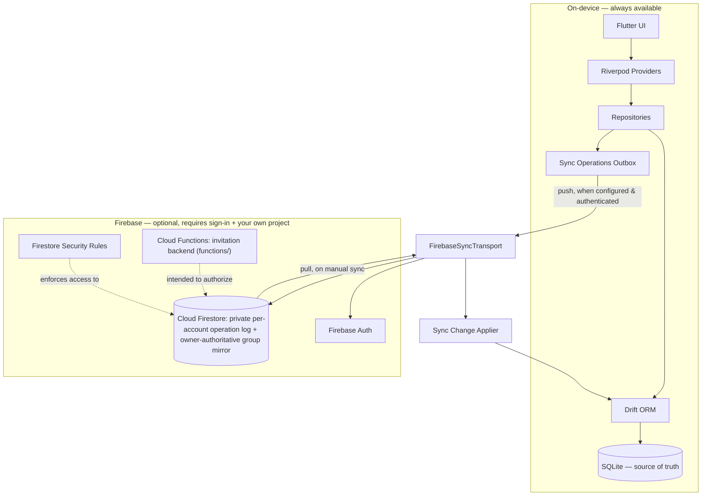

SQLite, via Drift, is the only source of truth on any device. The outbox and Firestore transport exist purely to mirror that local state into one signed-in account's private cloud storage.

## Application Architecture

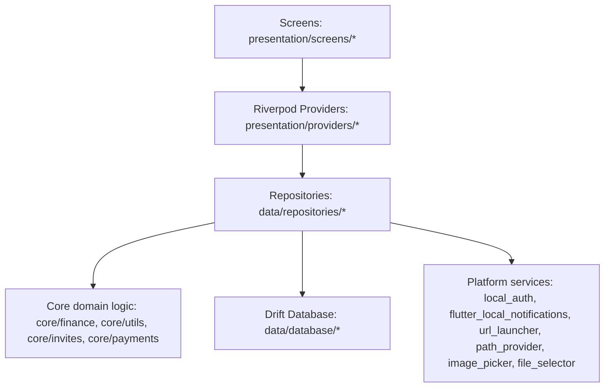

- **Presentation**: screens (onboarding, dashboard, groups, expenses, payments, activity, analytics, more, root shell) and Riverpod providers exposing repository streams/futures to widgets.
- **State management**: plain `flutter_riverpod` providers — no `riverpod_generator` code generation.
- **Repositories**: one per concern (users, groups, expenses, balances, activity, analytics, invites, reminders, recurring expenses, backup, export, sync, cloud IDs, Firebase auth, Firebase sync transport, sync change applier) — the only layer that talks to Drift directly.
- **Persistence**: a single Drift `AppDatabase`, schema version 12, defined in `tables.dart`.
- **Core/domain logic**: pure, framework-independent — `finance/` (split + balance engines), `utils/money.dart`, `invites/invite_payload.dart`, `payments/upi_payment.dart`, `sync/cloud_runtime.dart`.

## Local-First Data Flow

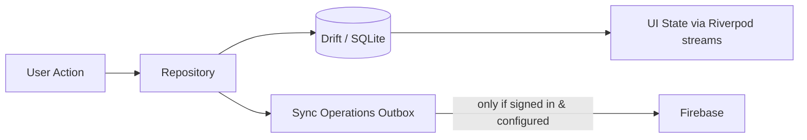

Every user action commits to SQLite through a repository first; UI state is just a stream over that same database. Queuing an outbox entry is a side effect of the same write, not a precondition for it — the write succeeds and the UI updates identically whether or not sync is configured.

## Expense Creation Flow

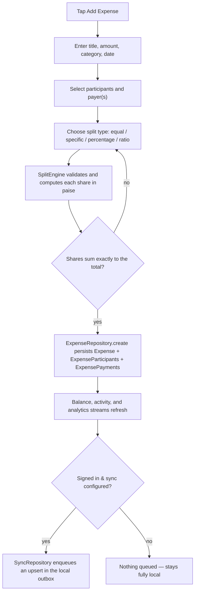

## Settlement Flow

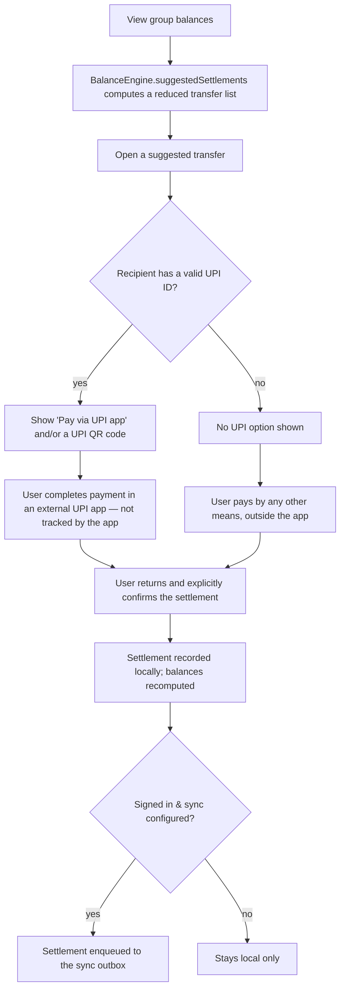

## Firebase Sync Architecture

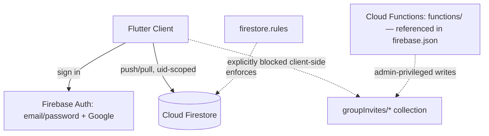

**Implemented in the client code:**
- Email/password and Google sign-in (`FirebaseAuthRepository`).
- A durable outbox (`SyncOperations`) that mirrors local writes to `quicksplitUsers/{uid}/operations/*` in Firestore, plus an owner-authoritative mirror under `groups/{groupId}/...` for group/expense/settlement data.
- A manual, timeout-bounded (20s), de-duplicated sync run that pushes queued operations and pulls remote changes back into Drift idempotently.

**Enforced by `firestore.rules`:**
- `quicksplitUsers/{userId}/{document=**}` — read/write allowed **only** when `request.auth.uid == userId`. Every account's operation log is private to that account.
- `groups/{groupId}` — creation requires `ownerId == request.auth.uid`; only the owner can update or write nested `members`, `expenses`, or `settlements`; a **member who isn't the owner can only read** the group mirror, never write to it; deletion is disabled outright (`allow delete: if false`).
- `groupInvites/{inviteId}` — **`allow read, write: if false` for every client**, with no exception. Only privileged (Admin SDK) server code — i.e., a Cloud Function — can touch this collection at all.

**What this means in practice:** the current rules enforce **single-account, multi-device private backup**, plus a read-only mirror that a second "member" account *could* read if manually granted access — but no client can write cross-account data, and no client can create or join an invitation directly. Any cross-account group-invitation feature has to go through a Cloud Function, consistent with the client-side stubs described below.

**Configuration & deployment status:**
- `firebase.json` configures an **Android** Firebase client (`projectId: campus-quicksplit`) and points at `firestore.rules` and a `functions/` codebase — it does **not** include a macOS Flutter configuration entry.
- `FIREBASE_SETUP.md` describes the intended full setup: create the Firebase project, enable Email/Password auth, Firestore, and Cloud Functions; run `flutterfire configure`; install and deploy Functions (`cd functions && npm install && npm run deploy`); deploy `firestore.rules` before enabling sync for real users. Invitation creation/joining is intended to be authorized by Cloud Functions that store only a **SHA-256 hash of the invite token** and create memberships **transactionally**.
- The Cloud Functions implementation lives in `functions/` — refer to that source for the exact validation, hashing, and transaction logic.
- **Whether Firestore, Functions, and rules have actually been deployed to a live Firebase project is an operational state, not something the source alone confirms.** Treat sync and invitations as *implemented client-side and rules-ready*, pending your own project's deployment.

## QR Group Invitations

> 🚧 **In Progress** — not usable end-to-end in the current build.

The codebase contains real invitation machinery: a versioned `GroupInvitePayload` (legacy local v1, portable v2, and cloud v3 carrying an `invitationId` + opaque token), a cryptographically secure 32-character token generator, an `InviteRepository`, dedicated QR-generation and QR-scanning screens, and a `SyncRepository.enqueueInviteJoin` outbox entry intended for a server-validated join. `firestore.rules` backs this up by locking the `groupInvites` collection to server-only (Cloud Functions) access, and `FIREBASE_SETUP.md` describes token hashing (SHA-256) and transactional membership creation on the server side.

**Current UI status:**
- The "Invite" button on the Group Detail screen doesn't open the QR screen — it unconditionally shows *"Secure cross-account invitations are not available yet."*
- The QR-generation screen is never navigated to from anywhere in the app.
- The scan screen is reachable and its decoding logic is real, but scanning a v3 cloud invitation throws *"Secure cross-account invitations are not available in this build,"* and a v2 "portable" invitation is rejected with a message to request a new QR code.
- Only a legacy v1 "local" invitation can complete a join today — and there's currently no UI path that produces one to scan.

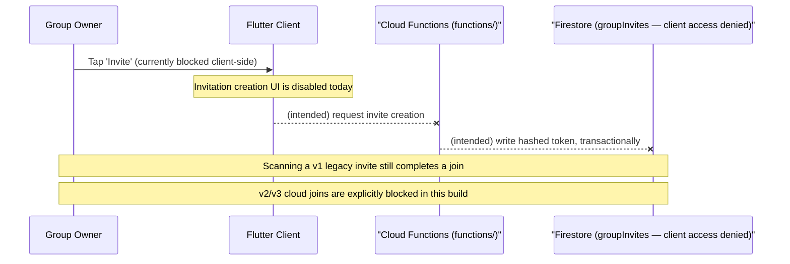

Treat this as a feature whose data model and security boundary are ready, but whose UI and server implementation are still in progress.

## Data Model

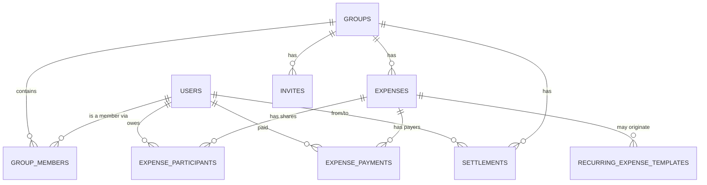

Drift schema, version 12 (`lib/data/database/tables.dart`):

| Table | Purpose | Notable fields / constraints |
|---|---|---|
| `Users` | Local person records — the device owner plus any member added by name; no server-side account directory | `isCurrentUser` marks the device owner; `email`/`phoneNumber`/`upiId` are optional, never lookup keys |
| `Groups` | A shared-expense group | `isArchived` soft-hides without deleting history |
| `GroupMembers` | Join table, `Groups` ↔ `Users` | Composite PK `(groupId, userId)`, cascade delete |
| `Invites` | An invitation token for a group | `token` unique; `expiresAt` / `isActive` gate validity |
| `Expenses` | A single logged expense | `totalAmountPaise` is an integer, never `REAL`; `splitType` enum; `isDeleted` soft-delete; `recurringOccurrenceKey` unique |
| `ExpenseParticipants` | Each participant's computed **share**, in paise | Composite PK `(expenseId, userId)`; sum must equal `totalAmountPaise` (enforced by the split engine, not a DB constraint) |
| `ExpensePayments` | Each payer's actual **contribution**, in paise | Composite PK `(expenseId, userId)`; supports multiple payers |
| `Settlements` | A recorded repayment between two users | `status` enum (`pending`/`completed`) |
| `RecurringExpenseTemplates` | A repeat rule derived from a source expense | `intervalDays`, `nextDueAt`, `isActive` |
| `ReminderSchedules` | A local notification schedule | `frequency` enum (`once`/`daily`/`weekly`/`monthly`), hour/minute, optional weekday/dayOfMonth |
| `SyncOperations` | Durable local outbox | `operationKey` unique (idempotency), `retryCount`, `lastError`, `syncedAt` |
| `CloudIdMappings` | Local row ↔ cloud identifier | Composite PK `(entityType, localId)`; `cloudId` unique |
| `AppSettingsTable` | Single-row local preferences | `themeMode`, `onboardingComplete`, `lockEnabled` (delegates entirely to the OS's own biometric/credential store) |

## Expense Splitting

| Split type | Input | Formula | Validation | Example |
|---|---|---|---|---|
| **Equal** | Total + participant list | `base = total ÷ n`; first `total mod n` participants get one extra paisa | Total > 0, participants unique and non-empty | ₹1,001 ÷ 3 → ₹333.67, ₹333.67, ₹333.66 (sums to exactly ₹1,001) |
| **Specific amount** | Total + one paise amount per participant | Amounts taken as given | Every amount positive, no duplicate participant, sum must equal the total exactly | ₹1,200 → Alice ₹700, Bob ₹500 |
| **Percentage** | Total + a whole-number percentage per participant | Same largest-remainder distribution as ratio, using percentages as weights | Percentages must sum to exactly 100 and be non-negative, at least one positive | ₹1,000 at 50/30/20 → ₹500, ₹300, ₹200 |
| **Ratio** | Total + an integer weight per participant | `share[i] = floor(total × weight[i] ÷ Σweight)`, remainder distributed to the largest fractional remainders first (ties broken by index) | Weights non-negative, at least one positive | ₹100 at weights 2/1/1 → ₹50, ₹25, ₹25 |

All four are implemented in `SplitEngine` and persisted as `ExpenseParticipants` rows; the sum of shares for a given expense is guaranteed to equal `Expenses.totalAmountPaise` exactly before the write happens.

## Money & Financial Correctness

- **No `REAL`/`double` money columns anywhere** — `totalAmountPaise`, `amountOwedPaise`, `amountPaidPaise`, and `amountPaise` (on `Settlements`) are all Drift `IntColumn`s.
- **Exact-sum splitting** via integer division plus explicit remainder distribution — `n` shares of a total always sum to exactly that total.
- **Largest-remainder ratio/percentage allocation** — `floor(total × weight ÷ Σweight)` per share, with leftover paise handed to the largest fractional remainders first, tie-broken by a stable index for determinism.
- **Specific-amount splits are validated, not trusted** — rejected unless every amount is positive, every participant appears once, and the sum matches the total exactly.
- **UPI amounts are derived, never re-entered** — `UpiPayment.amountFromPaise` converts the same paise integer to UPI's required decimal string with no floating-point step.
- **Rupee display is display-only** — the `Money.rupees` double getter exists purely for `intl` currency formatting and never feeds back into a calculation.

## Balance & Settlement Algorithm

`BalanceEngine.positions` computes each person's **net position** in paise from three inputs: payments made (credit), shares owed (debit), and completed settlements (transfer). A positive net position means the group owes that person; negative means they owe the group.

`BalanceEngine.suggestedSettlements` reduces those positions to a small set of transfers using **greedy debtor/creditor matching**: sort creditors and debtors each by amount descending (tie-broken by a stable user-ID order), then repeatedly transfer `min(largest creditor's remainder, largest debtor's remainder)` between the two largest remaining parties until every position reaches zero.

This is a **deterministic greedy heuristic**, not a provably minimum-transaction solver — it reliably reduces the transfer count versus naive pairwise settling, but the implementation makes no claim to mathematical optimality.

```text
A: +₹500   B: -₹300   C: -₹200

Suggested settlements:
  B → A   ₹300
  C → A   ₹200
```

A settlement only affects a balance once it's written to the `Settlements` table — which only happens after explicit user confirmation.

## Technology Stack

From the project's `pubspec.yaml` (`sdk: ^3.12.0`, `flutter: ">=3.44.0"`):

| Category | Package | Version | Purpose |
|---|---|---|---|
| State management | `flutter_riverpod` | ^2.6.1 | Providers/streams connecting repositories to widgets — no code generation |
| Local database | `drift` | ^2.22.1 | SQLite ORM; schema v12 with a defined migration strategy |
| | `sqlite3_flutter_libs` | ^0.5.27 | Native SQLite engine for Drift |
| | `path_provider`, `path` | ^2.1.5 / ^1.9.0 | Locating app-owned storage for the DB, exports, and backups |
| IDs | `uuid` | ^4.5.1 | Client-generated primary keys for every local entity |
| Formatting | `intl` | ^0.19.0 | `en_IN` currency formatting, date formatting |
| QR codes | `qr_flutter` | ^4.1.0 | Rendering invitation/payment QR codes |
| QR scanning | `mobile_scanner` | ^7.0.1 | Camera-based QR/barcode scanning |
| Payments | `url_launcher` | ^6.3.1 | Opening a `upi://pay` intent in an installed UPI app |
| Notifications | `flutter_local_notifications` | ^22.3.0 | OS-scheduled local reminders |
| | `timezone` | ^0.11.1 | Timezone-aware scheduling |
| Device auth | `local_auth` | ^3.0.2 | Optional biometric/device-credential app lock |
| Files | `image_picker` | ^1.2.3 | Picking a receipt photo when adding an expense |
| | `file_selector` | ^1.1.0 | Picking a backup JSON file to restore, during onboarding |
| Firebase — auth | `firebase_auth` | ^6.6.1 | Email/password + Google sign-in |
| | `google_sign_in` | ^6.3.0 | Google account credential flow |
| Firebase — data | `firebase_core` | ^4.14.0 | Firebase app bootstrap |
| | `cloud_firestore` | ^6.9.0 | Optional private sync backend |
| Dev — codegen | `build_runner`, `drift_dev` | ^2.4.13 / ^2.22.1 | Generating `app_database.g.dart` from the Drift table definitions |
| Dev — quality | `flutter_lints` | ^5.0.0 | Lint ruleset (`analysis_options.yaml` layers on `prefer_const_constructors`, `require_trailing_commas`, `avoid_print`, `prefer_single_quotes`) |

> `share_plus` is declared in `pubspec.yaml` but is not currently imported anywhere in `lib/` — treat it as a reserved dependency rather than an active feature.

## Project Structure

```text
campus_quicksplit/
├── android/                     # Android platform project (minSdk 24, Java 17)
│   └── app/
│       ├── build.gradle.kts
│       └── google-services.json # FlutterFire-generated Android client config
├── macos/                       # macOS platform project
├── functions/                   # Firebase Cloud Functions (TypeScript) — invitation backend
├── lib/
│   ├── main.dart                # Best-effort Firebase init, then runs the app
│   ├── firebase_options.dart    # FlutterFire-generated platform options
│   ├── core/
│   │   ├── constants/           # App name, category list, spacing/radius scale
│   │   ├── finance/             # split_engine.dart, balance_engine.dart
│   │   ├── invites/             # invite_payload.dart — versioned QR payload + token gen
│   │   ├── payments/            # upi_payment.dart — UPI URI construction/validation
│   │   ├── sync/                # cloud_runtime.dart — defensive Firebase init
│   │   ├── theme/
│   │   └── utils/               # money.dart — paise Money type
│   ├── data/
│   │   ├── database/            # tables.dart, app_database.dart (+ generated .g.dart)
│   │   └── repositories/        # one repository per concern
│   └── presentation/
│       ├── app.dart              # MaterialApp + onboarding/root-shell startup gate
│       ├── providers/
│       ├── screens/               # onboarding, dashboard, groups, expenses, payments,
│       │                          # activity, analytics, more, root shell
│       └── widgets/
├── test/
│   ├── core/                    # finance, invites, payments, sync, utils unit tests
│   ├── data/                    # database migration + repository tests
│   └── presentation/             # widget/provider tests
├── firestore.rules              # Firestore security rules (see Firebase Sync Architecture)
├── firebase.json                # FlutterFire/Firebase CLI project config
├── FIREBASE_SETUP.md            # Project-authored Firebase setup guide
├── analysis_options.yaml
├── pubspec.yaml
└── pubspec.lock
```

## Quick Start

```bash
git clone <https://github.com/KaranAgrawal25/Campus-QuickSplit.git>
cd campus_quicksplit
flutter pub get
flutter run
```

The app runs fully offline out of the box — no Firebase project or configuration is required to create groups, log expenses, and settle up. See [Firebase Setup](#firebase-setup) if you also want cloud sign-in/sync.

## Requirements

- **Flutter** ≥ 3.44.0, **Dart** SDK `^3.12.0` (from `pubspec.yaml`'s `environment:` block).
- **Android**: minSdk 24, compiled with Java/Kotlin 17, Gradle 9.1 wrapper.
- **Node.js + npm**, only if you intend to work on the Cloud Functions backend in `functions/`.
- **Firebase CLI** and **FlutterFire CLI**, only if you intend to configure your own Firebase project (see [Firebase Setup](#firebase-setup)).
- No `ios/` platform project is present. A `macos/` platform project exists but currently has no Firebase client configuration (`firebase.json` configures Android only) — run `flutterfire configure` for macOS if you need cloud features there.

## Installation

Before running the app, confirm your environment is set up correctly:

```bash
flutter doctor      # confirm Flutter/Dart/Android toolchain is healthy
flutter devices     # confirm a device or emulator is available
```

Then follow [Quick Start](#quick-start) above. Replace `<REPOSITORY_URL>` with this project's real Git remote.

## Running the App

### Android
```bash
flutter run
```
Targets minSdk 24; the release build type currently reuses the debug signing config (see [Limitations](#limitations)).

### macOS
```bash
flutter run -d macos
```
Firebase client configuration for macOS has not yet been generated (`firebase.json` currently only configures Android) — run `flutterfire configure` and select macOS to enable sign-in/sync on desktop.

### iOS
Not currently supported — no `ios/` platform project exists in this repository.

## Firebase Setup

Firebase is entirely optional — skip this section to use the app local-only. This project's own `FIREBASE_SETUP.md` documents the intended setup:

1. Create a Firebase project; enable **Email/Password** authentication, **Cloud Firestore**, and **Cloud Functions**.
2. Install the Firebase CLI and FlutterFire CLI, then from the project root:
   ```bash
   firebase login
   dart pub global activate flutterfire_cli
   flutterfire configure
   ```
   Select the platforms you need. This generates `lib/firebase_options.dart` and the platform client config files (e.g. `android/app/google-services.json`). These identifiers are not secrets.
3. Install Functions dependencies and deploy the invitation backend:
   ```bash
   cd functions && npm install && npm run deploy
   ```
   See `functions/` for the exact validation, token-hashing, and transaction logic.
4. Deploy `firestore.rules` **before** enabling sync for real users:
   ```bash
   firebase init firestore
   firebase deploy --only firestore:rules
   ```
5. Sign in from the **More** screen to enable sync. The outbox is private to the authenticated account; invitation creation/joining is intended to be authorized by Cloud Functions that store only a SHA-256 hash of the invite token and create memberships transactionally.

**Never commit** a Firebase service-account credential file. Client config files (`google-services.json`, `GoogleService-Info.plist`, `firebase_options.dart`) are not secrets and are safe to commit under FlutterFire's standard workflow.

## Configuration

- No `--dart-define` flags or `.env`-style runtime configuration exist in the `lib/` source.
- Firebase client configuration lives in `lib/firebase_options.dart` and the platform-specific config files generated by `flutterfire configure`; `firebase.json` records which Firebase project (`campus-quicksplit`) and platforms are wired up.
- `analysis_options.yaml` layers project-specific lint rules on top of `package:flutter_lints/flutter.yaml`.

## Build

```bash
flutter build apk --debug
```

The Android release build type currently reuses the **debug signing configuration** (`android/app/build.gradle.kts`) — add a dedicated release signing configuration before shipping a real release build.

## Testing

```bash
flutter analyze
flutter test
```

Coverage found in `test/`:
- **Core** (`test/core/`): `SplitEngine` (equal/specific/percentage/ratio), `BalanceEngine`, `Money` arithmetic, UPI payment construction/validation, invite payload encode/decode, a cloud-auth-redirect scenario.
- **Data** (`test/data/`): Drift migration behavior; repository tests for expenses (including multiple payers), groups, balances, analytics, and sync (including the Firestore transport's query shape and the change applier).
- **Presentation** (`test/presentation/`): onboarding, root shell lifecycle, adding an expense with multiple payers, adding a group member, the manual-sync provider.

## Backup & Restore

- **Format**: versioned, data-only JSON (`format: campus-quicksplit-backup`), including users, groups, memberships, expenses, participants, payments, settlements, recurring templates, reminders, app settings, and the local↔cloud ID mapping table.
- **Excluded by design**: receipt image bytes, device credentials, biometric data.
- **Restore is one-way and setup-only**: the "More" screen's restore entry point is only available during first-time setup; the restore call itself (`restoreIntoEmptyDatabase`) requires an empty local database — it does not merge into or overwrite an existing installation.
- **Local, not cloud**: backups are files written to app-owned storage on-device; the backup mechanism is independent of the Firebase sync outbox.

## Security & Privacy

**What's protected:**
- Money never touches floating-point arithmetic.
- Local primary keys never leave the device as cloud identifiers — `CloudIdMappings` translates every entity before it's written to Firestore.
- `firestore.rules` restricts each account's operation log to `quicksplitUsers/{that account's own uid}` only, restricts group/expense/settlement **writes** to the group's owner, and **completely denies client access** (`read` and `write`) to the `groupInvites` collection.
- Invitation tokens are generated with a cryptographically secure random source.
- Backups and the sync outbox never include receipt bytes, device credentials, or biometric data; the app-lock delegates entirely to the OS's own credential store.


## Limitations

- UPI payment completion is not externally verified.
- QR-based group invitations aren't usable end-to-end in the current UI.
- Android release builds currently reuse the debug signing configuration.
- No iOS platform project exists; the macOS platform project has no Firebase client configuration generated yet.

## Roadmap / Future Improvements

*(Ideas only — none of these are implemented today.)*

- Complete the cloud-invitation flow end to end: enable the UI, and implement/deploy the Cloud Function join that the v3 payload and `groupInvites` rules already anticipate.
- Add a dedicated Android release signing configuration.
- Confirm/complete macOS support, and consider iOS.
- Richer sync conflict resolution if/when true multi-user shared groups are built.

## Contributing

Contributions are welcome.

Please read the [Contributing Guidelines](CONTRIBUTING.md) before opening an issue or pull request.

## License

Campus QuickSplit is licensed under the [MIT License](LICENSE).
